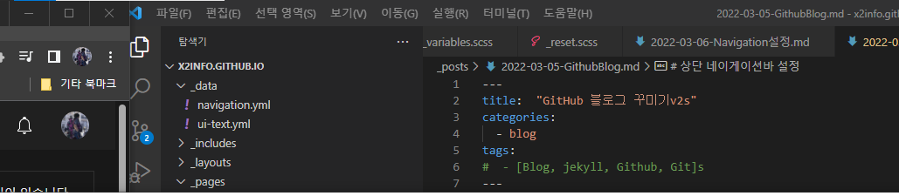

# 상단 네이게이션바 설정

_data > navigation.yml 파일 수정을 수정한다.
title과 url을 순차적으로 


```
main:
  - title: "Quick-Start Guide"
    url: https://mmistakes.github.io/minimal-mistakes/docs/quick-start-guide/
  - title: "Naver"
    url: https://www.naver.com/
  # - title: "About"
  #   url: https://mmistakes.github.io/minimal-mistakes/about/
  # - title: "Sample Posts"
  #   url: /year-archive/
  # - title: "Sample Collections"
  #   url: /collection-archive/
  # - title: "Sitemap"
  #   url: /sitemap/

```




