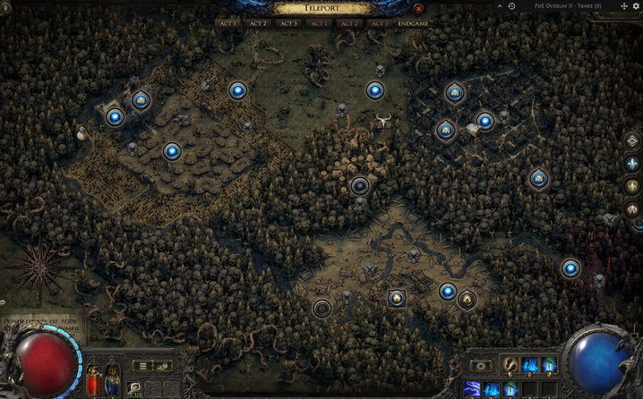
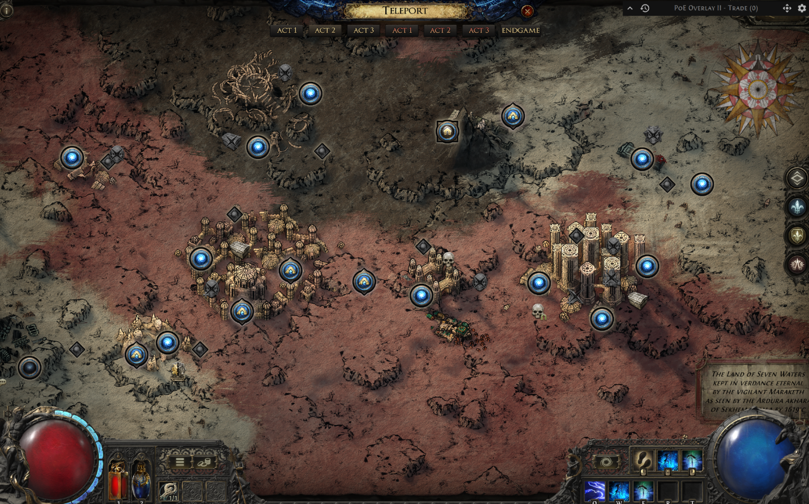
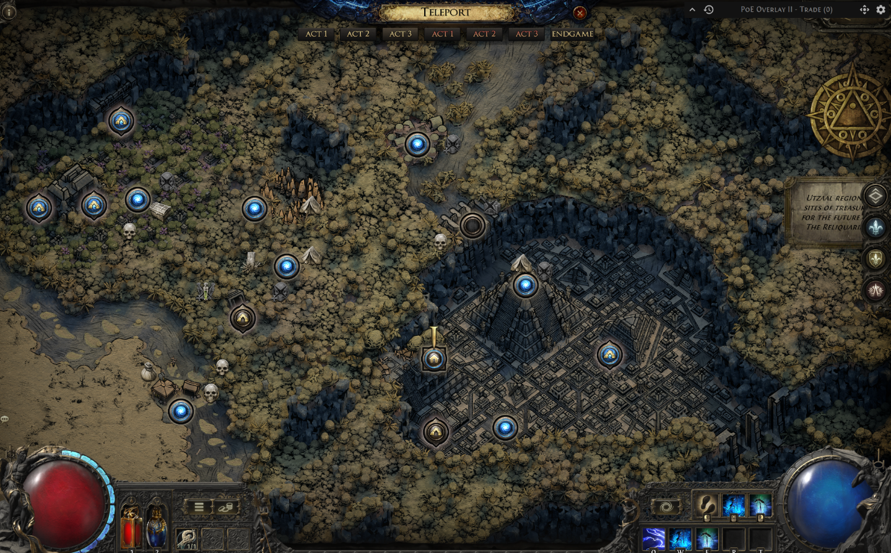

## #액트 보상
POE2 얼리억세스 기준으로 레벨업 동선 가이드 입니다. 

퀘스트 보상 및 동선을 정리했으며, 모든 액트를 진행 후에 얻을 수 있는 영구 보상은 패시브 스킬 포인트 +24와 정신력 +100, 생명력 +20, 최대 생명력 +8%, 화염 저항 +20%, 냉기 저항 +20%, 번개저항 +20% 입니다. 

## #ACT1

ACT 1에서 받을 수 있는 액트 보상은 아래와 같습니다.
- 일반 보상: 무기 패시브 스킬 포인트 +4, 냉기 저항 +10%, 정신력 +30, 생명력 최대치 +20
- 잔혹 보상: 무기 패시브 스킬 포인트 +4, 냉기 저항 +10%, 최대 생명력 +8%

---

  <h4>※🟢일반과 🔴잔혹 표시가 되어 있는 부분은 해당 난이도에서만 진행합니다.</h4>

### 1. 클리어펠 
- ⚔️ 썩은 무리의 베이라 
- 🏆 냉기 저항 +10%  

### 2. 클리어펠 (🟢)  
- 🔍 미스터리 오두막 
- 🏆 미가공 스킬 젬 (상자 오픈) 

  <h4>📌 미가공 보조젬이 추가로 필요한 경우 진흙 토굴의 포식자 처치</h4>

### 3. 그렐우드 (🟢)  
- ⚔️ 아리아그네 
- 🏆 미가공 보조 젬 (드랍)  

### 4. 붉은 계곡  
- 🔍 오벨리스크 3개  

### 5. 그렐우드  
- 🎯 룬의 인장  

### 6. 으스스한 덩굴  
- ⚔️ 썩은 드루이드(🟢)
- 🏆 미가공 보조 젬 (드랍)  

### 7. 집정관의 능묘  
- ⚔️ 드레이븐 
- 🗝️ 추모 열쇠 조각  

### 8. 배우자의 무덤 
- ⚔️ 아시니아 
- 🗝️ 추모 열쇠 조각  

  <h4>📌 미가공 보조젬이 추가로 필요한 경우 보물 상자를 찾아 열고 레어 몬스터 처치</h4>

### 9. 영원한 자의 공동묘지  
- ⚔️ 라클란 처치 
- 💍 라클란 백작의 반지  
- 🏆 미가공 보조 젬(마을 보상)

### 10. 사냥터  
- ⚔️ 까마귀 종 
- 🏆 +2 스킬 포인트  

### 11. 오검 농지  
- 🔍 우나의 류트 회수 
- 🏆 +2 스킬 포인트  

### 12. 오검 마을  
- 🔍 웨이포인트  

### 13. 프레이쏜  
- ⚔️ 연무 속의 왕 
- 🏆 정신력 +30  

### 14. 오검 마을 
- 🔍 렌리의 도구 찾기 
- 🏆 분해 작업대  

### 15. 오검 마을 
- ⚔️ 사형 집행자  

### 16. 오검 저택 1층  
- ⚔️ 양초 덩어리
  - 🏆 생명력 최대치 +20(🟢)
  - 🏆 생명력 최대치 +8%(🔴)

### 17. 오검 저택 3층     
- ⚔️ 지오너 백작  
- 🏆 미가공 보조 젬(마을 보상)

## #ACT 2

ACT 2에서 받을 수 있는 액트 보상은 아래와 같습니다.
- 일반 보상: 무기 패시브 스킬 포인트 +4, 번개 저항 +10%, 호신부 재충전 획득량 +30% / 마나 플라스크 회복량 +15%
- 잔혹 보상: 무기 패시브 스킬 포인트 +4, 번개 저항 +10%, 호신부 재충전 획득량 +30% / 생명력 플라스크 회복량 +15%

---

  <h4>※🟢일반과 🔴잔혹 표시가 되어 있는 부분은 해당 난이도에서만 진행합니다.</h4>

### 1. 바스티리 외곽  
- ⚔️ 토성 파괴자  

### 2. 모둔 채석장  

### 3. 모둔 광산  
- ⚔️ 룻자  

### 4. 배반자의 통로  
- ⚔️ 발바라  
- 🏆 발바라의 바리야  

### 5. 할라니 관문  
- ⚔️ 자만라  

### 6. 마스모톤 불모지  
- 🔍 뼈구덩이  

### 7. 뼈 구덩이  
- ⚔️ 에크밥 & 이크탑  
- 💎 마스모톤 엄니 획득  
- 🏺 태양 혈족 유물 획득 (랜덤 드랍)  

### 8. 케스  
- ⚔️ 카발라  
- 🏆 패시브 스킬 포인트 +2  
- 🏺 카발라 혈족 유물 획득 (랜덤 드랍)  

### 9. 잃어버린 도시  

### 10. 묻힌 성소  
- ⚔️ 아자리안  

### 11. 거신의 계곡  
- 🔍 태양/카발라 혈족 유물 넣기  
  - 🏆 호신부 충전량 30% 증가 / 플라스크로 얻는 마나 회복 15% 증가(🟢)
  - 🏆 호신부 충전량 30% 증가 / 플라스크로 얻는 생명력 회복 15% 증가(🔴)
- 🔍 고대의 봉인 3개  

### 12. 거신 석굴  
- ⚔️ 잘마라트  

### 13. 데샤르  
- 🔍 쓰러진 데카라  
- 🏆 패시브 스킬 포인트 +2  

### 14. 통곡의 길  

### 15. 데샤르의 첨탑  
- ⚔️ 가루칸의 자매들  
- 🏆 번개 저항 +10%  

### 16. 데샤르의 첨탑  
- 🔍 토르 굴  

### 17. 세케마의 시련  
- 🎯 1차 전직

### 18. 드레드노트  

### 19. 드레드노트 선봉대  
- ⚔️ 자만라  

## #ACT 3

ACT 3에서 받을 수 있는 액트 보상은 아래와 같습니다.
- 일반 보상: 무기 패시브 스킬 포인트 +4, 화염 저항 +10%, 정신력 +30 , 기절 한계치 +25% / 원소 상태이상 한계치 +30% / 마나 재생량 +25%
- 잔혹 보상: 무기 패시브 스킬 포인트 +4, 화염 저항 +10%, 정신력 +40 , 카오스 저항 +10% / 모든 능력치 +5 / 자신에게 걸린 느려짐 디버프 효과 15% 감소

---

  <h4>※🟢일반과 🔴잔혹 표시가 되어 있는 부분은 해당 난이도에서만 진행합니다.</h4>

### 1. 모래에 휩쓸린 습지  
- 🔍 아자크 모닥불 
- 🏆 하위 주얼러 오브  

### 2. 밀림 유적  
- ⚔️ 은빛주먹 
- 🏆 패시브 스킬 포인트 +2  

### 3. 들끓는 불모지  
- 🔍 웨이포인트  

### 4. 밀림 유적  
- 🔍 독액 지하실 & 독액 영약
- 🏆 독액 영약  
  - 🏆 빨강 = 기절 한계치 +25%, 초록 = 원소 상태이상 한계치 +30%, 노랑 = 마나 재생 +25%  (🟢)
  - 🏆 빨강 = 카오스 저항 +10%, 초록 = 모든 능력치 +5, 노랑 = 자신에게 걸린 감속 효과 -15% (🔴)

### 5. 들끓는 불모지  
- 🔍 아자크 습지대  

### 6. 아자크 습지대  
- ⚔️ 이그나그두크  
  - 🏆 정신력 +30 (🟢)  
  - 🏆 정신력 +40 (🔴)  

### 7. 키메랄 습지대  
- ⚔️ 자이클루시언 
- 🏆 키메랄 새겨진 결전  

### 8. 혼돈의 사원
- 🎯 2차전직

### 9. 지콰니의 기계실  
- ⚔️ 검은턱 
- 🏆 화염 저항 +10%  

### 10. 지콰니의 기계실  
- 🔍 지콰니의 지성소  

### 11. 지콰니의 지성소  
- ⚔️ 지코아 
- 🏆 큰 영혼 핵  

### 12. 들끓는 불모지  

### 13. 마틀란 수로  

### 14. 물에 잠긴 도시  

### 15. 오물의 정점  
- ⚔️ 오물의 여왕 
- 🏆 사원 문 우상  

### 16. 코펙의 사원 3층  
- ⚔️ 케출리  

### 17. 웃자알  
- ⚔️ 나푸앗지  

### 17. 웃자알  
- 🔍 희생의 심장 (랜덤 드랍)  

### 19. 아고라트  
- 🏺 제단에 희생의 심장 놓기 
- 🏆 패시브 스킬 포인트 +2  

### 20. 검은 내실  
- ⚔️ 도리아니  
