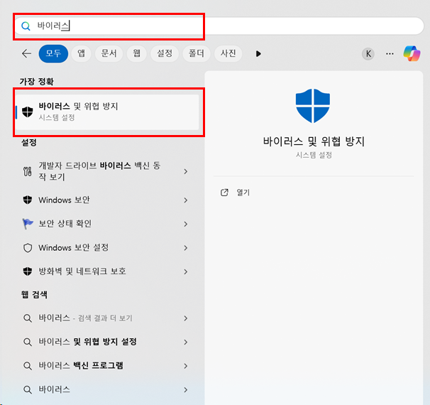
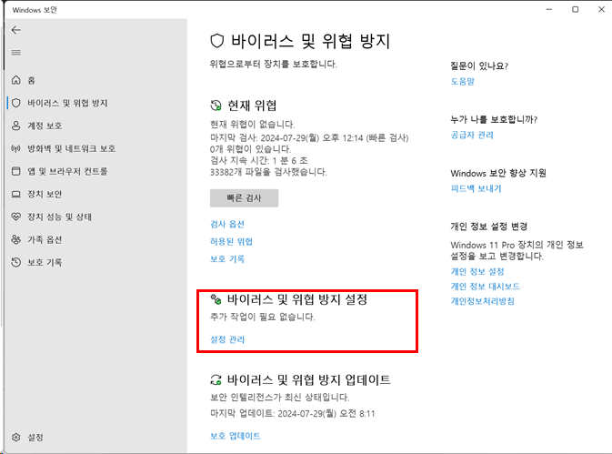
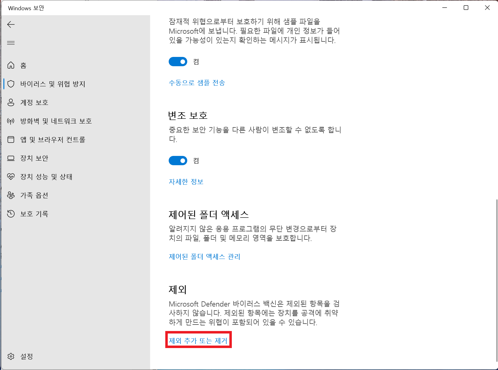
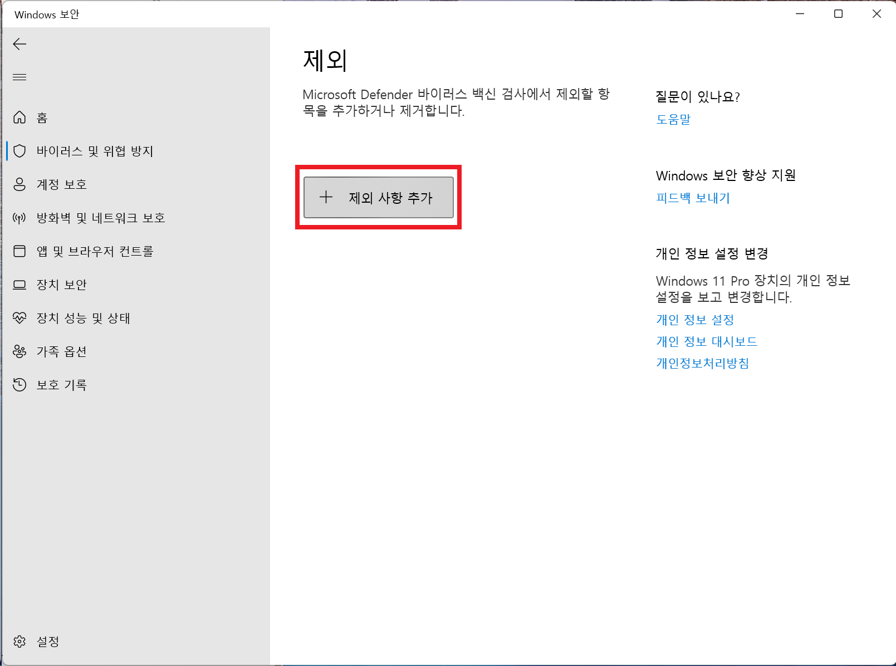
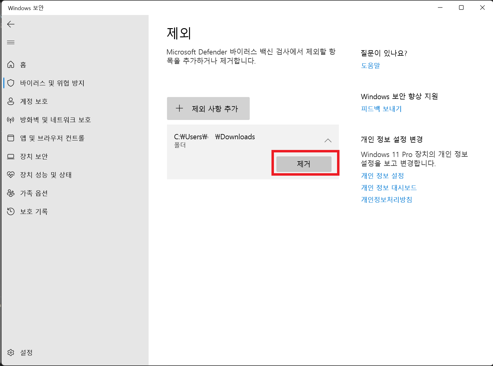

---

title:  "윈도우 인터넷 다운로드 해결 방법: 파일에서 바이러스가 발견됨"
header:
  overlay_image: "https://images.unsplash.com/photo-1530133532239-eda6f53fcf0f?q=80&w=2274&auto=format&fit=crop&ixlib=rb-4.0.3&ixid=M3wxMjA3fDB8MHxwaG90by1wYWdlfHx8fGVufDB8fHx8fA%3D%3D"
  caption: "Photo credit: [**Unsplash**](https://unsplash.com)"
excerpt: "윈도우에서 인터넷 파일을 다운로드 할 때마다 바이러스가 발견되어 삭제 될 경우 이를 해결 할 수 있는 방법을 안내합니다."
categories:
  - PC
tags:
  - [PC, IT]

toc_label: "  목차"
toc: true
toc_sticky: true
---

## # 문제 원인
윈도우에서는 기본적으로 MicroSoft Defender라고 하는 바이러스 백신이 동작하기 때문에, 별도의 백신 프로그램을 깔지 않더라도 어느정도 바이러스를 차단 할 수 있습니다. 

하지만 이로인해 인터넷에서 파일을 다운로드 받을 때 바이러스로 인식되어 파일이 자동으로 삭제되는 경우가 있습니다. 해당 파일이 진짜로 바이러스가 포함되어 있을수도 있지만, 검증된 출저로 확신이 들 경우 아래의 방법을 통해 문제를 해결할 수 있습니다. 

아래의 방법을 시도하기 전에 반드시 출저가 분명하지 않은 파일에 대해서는 의심을 충분히 한 뒤에 시도하시기를 추천합니다. 

## # 해결 방법
- 윈도우 키를 누른 후 바이러스라고 입력을 한 뒤에, "바이러스 및 위협 방지"를 선택합니다. 

- "바이러스 및 위협 방지 설정"을 선택합니다. 

- 스크롤을 맨 아래로 내리면 "제외"라는 항목에 "제외 추가 및 또는 제거"를 선택합니다. 

- "제외 사항 추가" 버튼을 눌러 웹 브라우저에서 다운로드되는 폴더를 지정합니다.  
- 이제 해당 폴더는 감시하지 않는 폴더가 되어 파일이 삭제되지 않습니다. 
 

- 파일을 다운로드 완료하였으면, 제거 버튼을 통해 원래 상태로 되돌려 줍니다.  
- 보안을 위해 원래 상태로 되돌려 주는 것이 좋습니다. 
