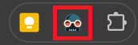
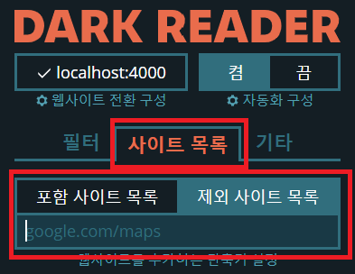
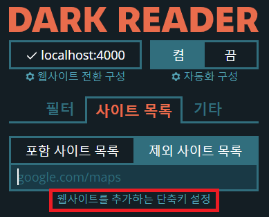

---

title:  "크롬 브라우저 다크리더 확장 프로그램 이용하여 다크모드 적용하기"
header:
  overlay_image: "https://images.unsplash.com/photo-1530133532239-eda6f53fcf0f?q=80&w=2274&auto=format&fit=crop&ixlib=rb-4.0.3&ixid=M3wxMjA3fDB8MHxwaG90by1wYWdlfHx8fGVufDB8fHx8fA%3D%3D"
  caption: "Photo credit: [**Unsplash**](https://unsplash.com)"
excerpt: "크롬 브라우저에서 다크리더라는 확장 프로그램을 설치하여 다크모드를 적용하는 방법에 대해 안내합니다."
categories:
  - PC
tags:
  - [PC, IT]

toc_label: "  목차"
toc: true
toc_sticky: true
---

## #다크리더(Dark Leader)
다크리더는 크롬 브라우저의 다크모드를 활성화 해주는 웹 스토어 확장 프로그램입니다. 개발자들이 선호하는 다크모드를 크롬 브라우저에서는 완벽하게 지원하고 있지 않습니다. 

저 역시 여러가자지 다크모드 확장 프로그램을 써본 결과 다크리더 만큼 좋은 확장 프로그램은 발견하지 못했습니다. 다크리더는 아래 버튼을 통해 크롬 웹스토어에서 다운로드하여 설치 할 수 있습니다.

[다크리더 설치 이동하기](https://chromewebstore.google.com/detail/dark-reader/eimadpbcbfnmbkopoojfekhnkhdbieeh){: .btn .btn--warning}

참고로 다크리더의 경우 오픈 소스로 아래 링크를 통해 Github에 접속하여 소스코드를 볼 수 있습니다.

[https://github.com/darkreader/darkreader](https://github.com/darkreader/darkreader)

설치가 완료되면 주소 표시줄 우측에 다크리더 아이콘 표시가 나타납니다.

## #기능 소개
기본적으로 모든 웹페이지에서 컨텐츠를 자동으로 인식하여 다크모드로 전환해줍니다. 다만 제가 써본 결과 구글 Docs나 기타 특정 웹페이지에서는 잘 표시가 안되는 문제가 있는데, 이 경우에는 해당 웹페이지를 제외 웹 페이지로 등록하여 활성화하지 않을 수도 있습니다.

제외 웹페이지 등록하는 방법은 주소 표시줄 우측의 다크리더 아이콘을 클릭합니다. 그리고 사이트 목록 탭으로 이동하여 제외 사이트 목록에 주소를 복사하여 붙여 넣기 하면 됩니다.

## #단축키 소개

사이트 목록 탭으로 이동하면 웹 사이트를 추가하는 단축키 설정 메뉴가 있습니다. 이 메뉴를 클릭하면 다크리더에서 사용 할 수 있는 단축키 설정 메뉴로 이동합니다.

기본적으로 Alt+Shift+D 버튼을 통해 다크리더를 On/Off 할 수 있는 단축키가 등록되어 있으며, 사실 나머지 단축키들은 크게 사용할 일은 없는것 같습니다.

