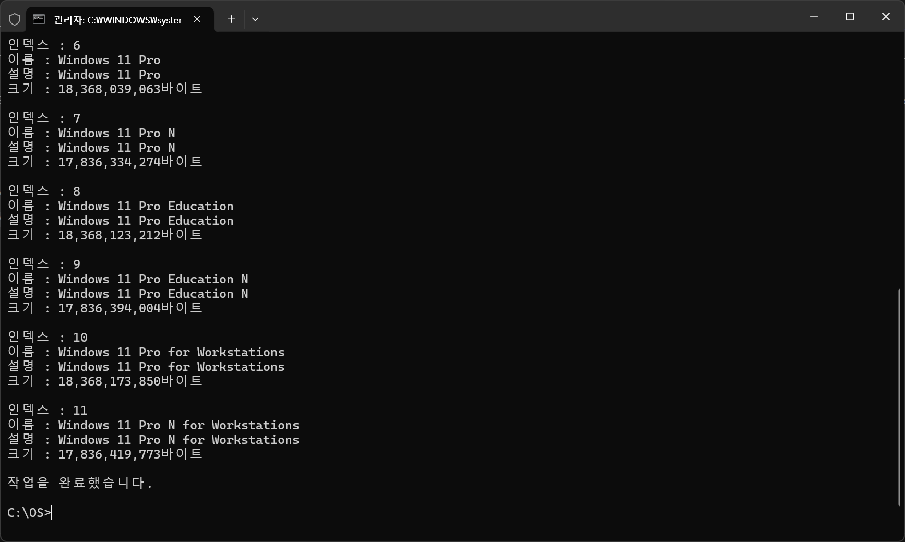

## # WIM 파일 이란?
WIM(Windows Imaging Format) 파일은 Microsoft에서 개발한 윈도우 설치, 응용 프로그램, 드라이버 및 기타 시스템 구성 요소를 포함한 단일 파일 입니다. 쉽게 얘기해서 윈도우 설치 할 때 WIM 파일을 압축해제 해서 설치 한다고 이해 하시면 이해가 쉽습니다. 

보통 윈도우를 설치하고 나면 드라이버나 응용 프로그램들이 없는 상태로 설치 되는데, WIM파일을 수정하면 새로 윈도우를 설치 할 때 드라이버나 응용프로그램을 설치된 상태로 설치 할 수 있습니다. WIM 파일의 수정과 배포는 DISM(Deployment Imaging Service and Management) 을 통해 할 수 있습니다.

## # WIM 파일 수정
우선 윈도우 ISO 파일을 우측 버튼을 눌러 탑재를 누릅니다. 그러면 ISO파일 내부를 볼 수 있는데, WIM 파일은 sources 폴더에 위치 합니다. 이 폴더에는 2가지 WIM 파일이 존재 하는데, boot.wim 파일과 install.wim파일입니다.

boot.wim파일은 USB로 부팅할 때 나오는 설치화면에서 동작하는 WinPE 기반의 WIM 파일 입니다. 이 WIM파일을 수정하면 설치 화면에서 필요한 드라이버를 포함 시켜줄 수 있는데, 예를 들어 노트북의 터치패드 드라이버를 포함시킨다면 USB 부팅 후 윈도우 설치 화면에서 터치패드가 동작하게 할 수 있습니다.

install.wim파일은 실제로 설치될 윈도우 이미지 입니다. 이 WIM파일을 수정하면 윈도우가 설치가 완료 되었을 때 드라이버나 응용프로그램이 추가된 상태로 설치가 완료 됩니다. 위에서 언급 했듯이  DISM(Deployment Imaging Service and Management) 을 통해 수정이 가능합니다.

## # DISM 명령어 맛보기
우선 수정할 WIM 파일을 복사 합니다.  그리고 WIM파일에 대한 정보를 아래 명령어를 통해 확인해봅니다.
```
//WIM 파일 정보 확인
dism /Get-WimInfo /WimFile:<경로>\install.wim
ex) dism /Get-WimInfo /WimFile:c:\OS\install.wim
```
아래 그림 파일을 보면 이 WIM 파일에는 Home, Pro와 같은 여러 버전의 윈도우 운영체제가 포함된 것을 볼 수 있으며, 인덱스로 구분되어 있는것을 볼 수 있습니다.



이제 WIM파일을 마운트 명령어를 통해 수정 가능한 상태로 만들어 보겠습니다. 현재 이 WIM파일에는 여러개의 운영체제 버전이 있기 때문에 수정할 버전의 인덱스를 명시해줘야 합니다.
저는 Pro 버전을 수정하기 위해 인덱스 6번을 지정했습니다.
```
//마운드 디덱토리 생성
mkdir offline

//마운트 
Dism /Mount-Image /ImageFile:c:\os\install.wim /MountDir:c:\os\offline /index:6
```

이제 드라이버를 추가해보겠습니다. 

```


Dism /Image:c:\os\offline /Add-Driver /Driver:%DRV_SRC% /Recurse

```
<div class="notice--danger" markdown="1">
📢드라이버는 DCH 형태의 드라이버 파일어야 합니다.
</div>


드라이버를 모두 추가 했으면, 아래 명령어를 통해 수정된 이미지를 Commit하여 최종적으로 반영합니다.

```

Dism /Unmount-Image /MountDir:c:\os\offline /Commit

```

