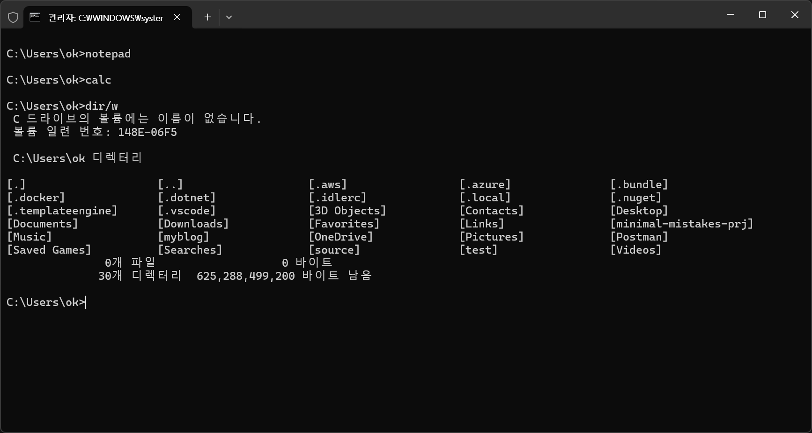
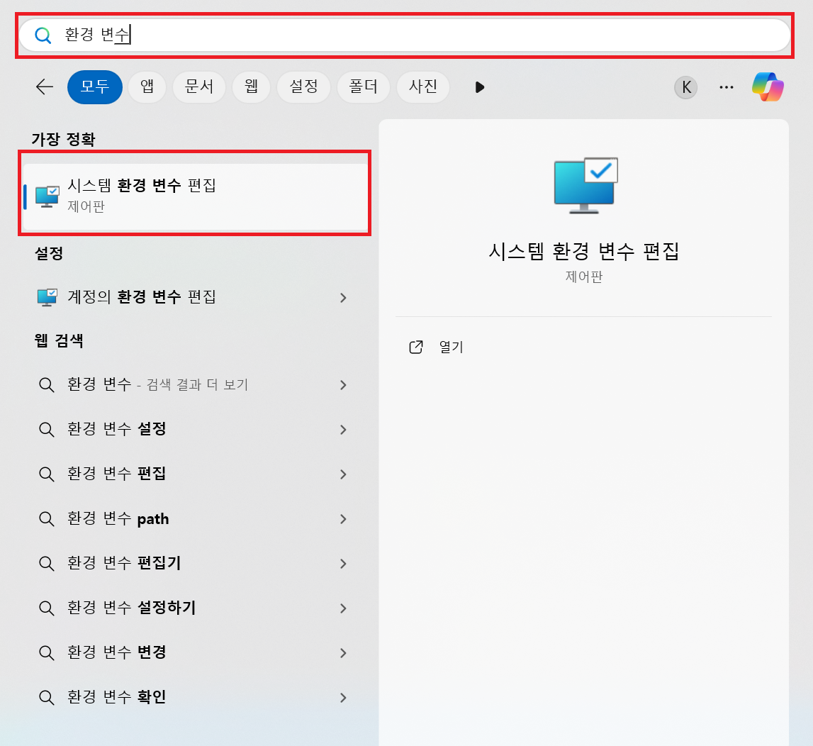
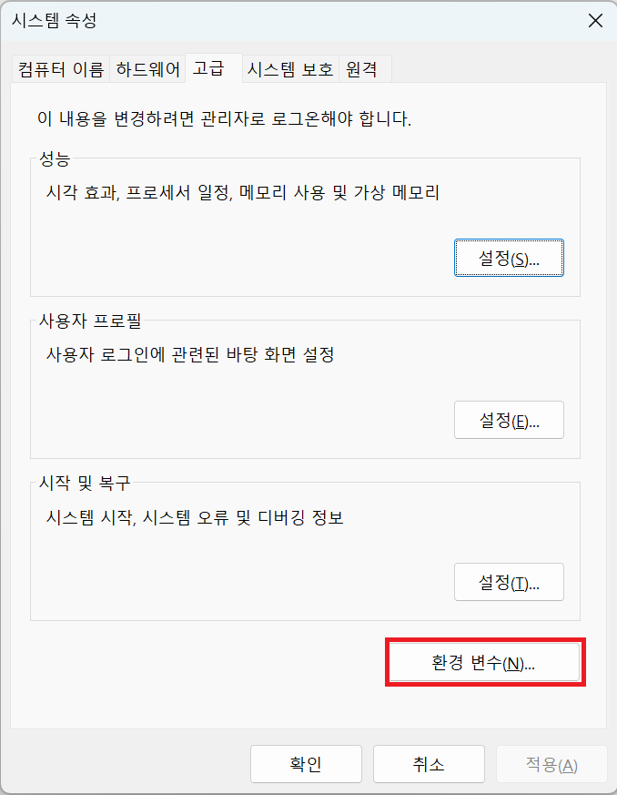
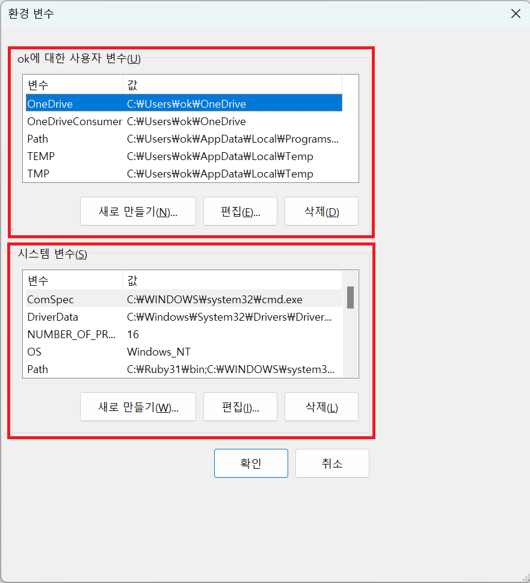
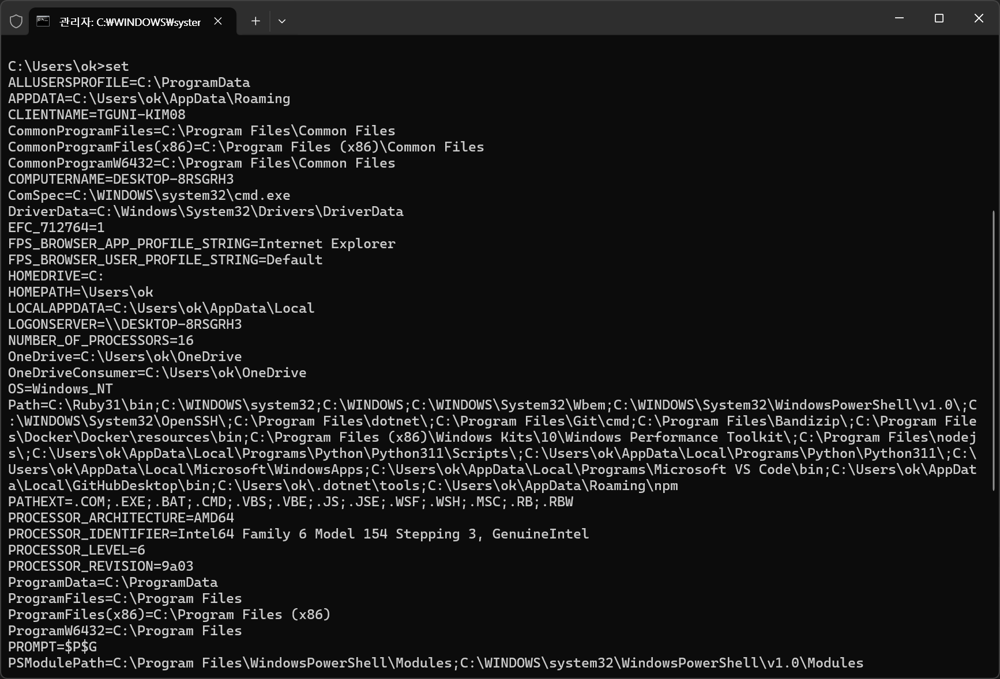
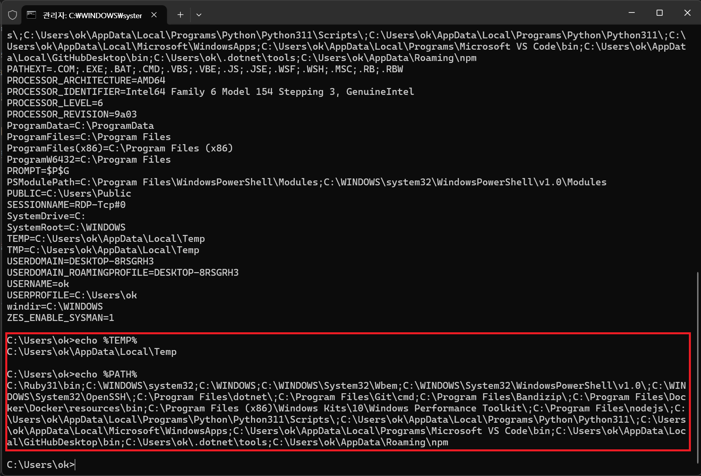
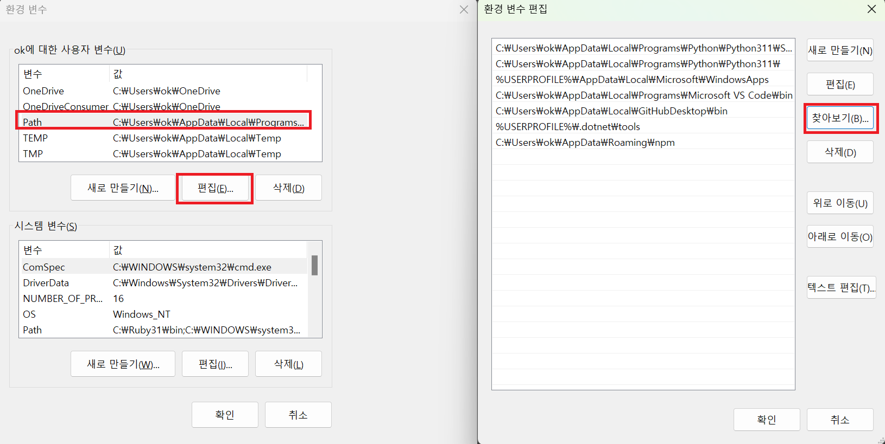

## # 환경 변수란?
윈도우에서 사용하는 환경 변수(Environment Variables)는 무얼일까요? 

환경 변수(Environment Variables)는 프로세스가 시스템의 설정이나 상태에 대한 정보를 참고할 때 사용하는 전역적인 변수 입니다. 다양한 설정과 경로를 통해, 프로세스 실행 시 필요한 정보를 제공하기도 합니다.

가장 많이 사용하는 시스템 변수는 PATH 입니다. 윈도우키 + R를 눌러서 cmd라는 키워드를 입력하면 command 창이 실행됩니다. 그리고 command창에서 notepad나 calc를 입력하면 메모장이나 계산기가 실행됩니다. 

하지만 dir/w 명령어를 통해 확인해 보면 notepad.exe, calc.exe 파일은 존재 하지 않습니다. 

실제로 이 파일은 "C:\Windows\System32"에 존재하고 있으며, 이 경로는 PATH라는 환경 변수 안에 포함되어 있습니다. command창이 실행 될 때 PATH라는 환경변수를 참조하여 현재 경로에 notepad.exe나 calc.exe가 없더라고 참조해서 실행되는 것입니다.

이러한 환경 변수는 특정 사용자 계정에만 적용 될 수도 있지만, 시스템 전체에 적용될 수 있는 환경 변수도 존재 합니다.

## # 환경 변수 출력 - 1
위에서 환경 변수에 대해서 간단히 알아 보았습니다. 실제로 시스템템에 적용되어 있는 환경 변수를 살펴 보겠습니다.

우선 윈도우 키를 누르고 "환경 변수"로 검색하면, 시스템 환경 변수 편집이라는 메뉴가 나타나는데, 이 메뉴를 클릭합니다.

여기서 환경 변수 버튼 누릅니다.

위는 사용자 개별로 각각 적용되는 사용자 환경 변수, 아래는 사용자가 변경되더라도 공통적으로 적용되는 시스템 환경 변수 입니다.

## # 환경 변수 출력 - 2
이번에는 command창에서 환경 변수를 출력해보겠습니다. set 이라고 입력하고 엔터를 쳐 봅니다. 모든 환경 변수가 출력되는 모습을 볼 수 있습니다.

echo 명령어를 통해 특정 환경 변수를 확인해 볼 수도 있습니다.

## # 환경 변수 편집(PATH)
PATH 환경 변수를 편집하는 방법은 PATH 환경 변수를 선택하고 편집 버튼을 누릅니다. 새로 만들기 버튼을 눌러 경로를 복사 붙여 넣을 수도 있으며, 찾아보기 버튼을 눌러서 직접 경로를 지정할 수도 있습니다. 

"찾아보기" 버튼 보다는 "새로 만들기" 버튼을 눌러 직접 경로를 붙여 넣는 것이 조금 더 빠른 방법이니 참고 하시면 됩니다.

