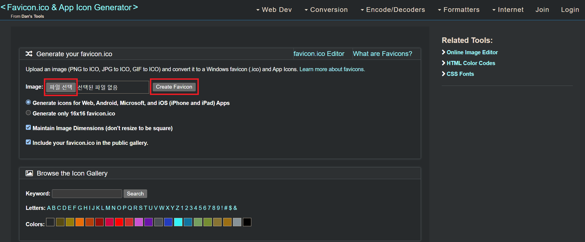
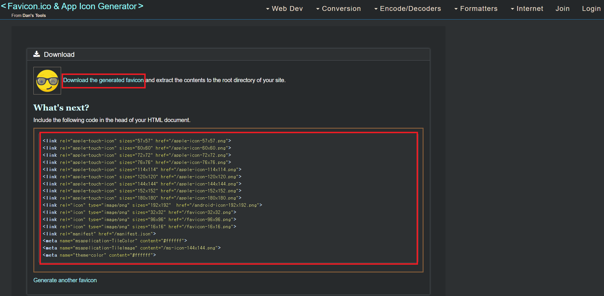

---

title:  "[minimal-mistakes] 깃허브(GitHub) 파비콘(favicon) 추가하는 방법"
header:
  overlay_image: "https://images.unsplash.com/photo-1498050108023-c5249f4df085?ixlib=rb-1.2.1&ixid=MnwxMjA3fDB8MHxwaG90by1wYWdlfHx8fGVufDB8fHx8&auto=format&fit=crop&w=1744&q=80"
  caption: "Photo credit: [**Unsplash**](https://unsplash.com)"

excerpt: "깃허브(GitHub) 블로그 Jekyll 테마 중 minimal-mistakes에서 파비콘(favicon) 추가하는 방법에 대해 설명합니다."
categories:
  - Minimal-Mistakes
tags:
  - [Blog, jekyll, Github]

toc_label: "  목차"
toc: true
toc_sticky: true

# date: 2020-05-25
# last_modified_at: 2020-05-25
---

## #파비콘(Favicon) 생성

⬇️ 파피콘을 생성할 이미지를 준비하고 아래 사이트로 이동합니다.<br>

-  <a href="https://www.favicon-generator.org/" class="btn btn--primary" target="_blank">🌍favicon-generator 바로가기</a>

⬇️ 파일을 선택하고 Create Favicon 버튼을 클릭합니다.

- 

⬇️ "Download Generated favicon" 버튼을 눌러 생성된 favicon을 다운로드 하고, 생성된 코드를 메모장에 복사해둡니다. 이 코드의 href 값 수정이 필요합니다.

- 

➡️ 다운로드 받은 favicon 압축 파일은 📁\assets\favicon폴더를 생성하고 이곳에 넣어 둡니다.

## #파비콘(Favicon) 적용
이제 파비콘을 적용하기 위해 이전에 메모장에 복사해두었던 코드를 수정합니다.

⬇️수정전

```html
<link rel="apple-touch-icon" sizes="57x57" href="/apple-icon-57x57.png">
<link rel="apple-touch-icon" sizes="60x60" href="/apple-icon-60x60.png">
<link rel="apple-touch-icon" sizes="72x72" href="/apple-icon-72x72.png">
<link rel="apple-touch-icon" sizes="76x76" href="/apple-icon-76x76.png">
<link rel="apple-touch-icon" sizes="114x114" href="/apple-icon-114x114.png">
<link rel="apple-touch-icon" sizes="120x120" href="/apple-icon-120x120.png">
<link rel="apple-touch-icon" sizes="144x144" href="/apple-icon-144x144.png">
<link rel="apple-touch-icon" sizes="152x152" href="/apple-icon-152x152.png">
<link rel="apple-touch-icon" sizes="180x180" href="/apple-icon-180x180.png">
<link rel="icon" type="image/png" sizes="192x192"  href="/android-icon-192x192.png">
<link rel="icon" type="image/png" sizes="32x32" href="/favicon-32x32.png">
<link rel="icon" type="image/png" sizes="96x96" href="/favicon-96x96.png">
<link rel="icon" type="image/png" sizes="16x16" href="/favicon-16x16.png">
<link rel="manifest" href="/manifest.json">
<meta name="msapplication-TileColor" content="#ffffff">
<meta name="msapplication-TileImage" content="/ms-icon-144x144.png">
<meta name="theme-color" content="#ffffff">

```

⬇️수정후

```html
<link rel="apple-touch-icon" sizes="57x57" href="/assets/favicon/apple-icon-57x57.png">
<link rel="apple-touch-icon" sizes="60x60" href="/assets/favicon/apple-icon-60x60.png">
<link rel="apple-touch-icon" sizes="72x72" href="/assets/favicon/apple-icon-72x72.png">
<link rel="apple-touch-icon" sizes="76x76" href="/assets/favicon/apple-icon-76x76.png">
<link rel="apple-touch-icon" sizes="114x114" href="/assets/favicon/apple-icon-114x114.png">
<link rel="apple-touch-icon" sizes="120x120" href="/assets/favicon/apple-icon-120x120.png">
<link rel="apple-touch-icon" sizes="144x144" href="/assets/favicon/apple-icon-144x144.png">
<link rel="apple-touch-icon" sizes="152x152" href="/assets/favicon/apple-icon-152x152.png">
<link rel="apple-touch-icon" sizes="180x180" href="/assets/favicon/apple-icon-180x180.png">
<link rel="icon" type="image/png" sizes="192x192"  href="/assets/favicon/android-icon-192x192.png">
<link rel="icon" type="image/png" sizes="32x32" href="/assets/favicon/favicon-32x32.png">
<link rel="icon" type="image/png" sizes="96x96" href="/assets/favicon/favicon-96x96.png">
<link rel="icon" type="image/png" sizes="16x16" href="/assets/favicon/favicon-16x16.png">
<link rel="manifest" href="/assets/favicon/manifest.json">
<meta name="msapplication-TileColor" content="#ffffff">
<meta name="msapplication-TileImage" content="/assets/favicon/ms-icon-144x144.png">
<meta name="theme-color" content="#ffffff">

```

<br>
이제 📝_includes\head\custom.html 파일을 열고 위에서 수정한 코드를 삽입합니다.


```html
<!-- start custom head snippets -->

<!-- insert favicons. use https://realfavicongenerator.net/ -->
<link rel="apple-touch-icon" sizes="57x57" href="/assets/favicon/apple-icon-57x57.png">
<link rel="apple-touch-icon" sizes="60x60" href="/assets/favicon/apple-icon-60x60.png">
<link rel="apple-touch-icon" sizes="72x72" href="/assets/favicon/apple-icon-72x72.png">
<link rel="apple-touch-icon" sizes="76x76" href="/assets/favicon/apple-icon-76x76.png">
<link rel="apple-touch-icon" sizes="114x114" href="/assets/favicon/apple-icon-114x114.png">
<link rel="apple-touch-icon" sizes="120x120" href="/assets/favicon/apple-icon-120x120.png">
<link rel="apple-touch-icon" sizes="144x144" href="/assets/favicon/apple-icon-144x144.png">
<link rel="apple-touch-icon" sizes="152x152" href="/assets/favicon/apple-icon-152x152.png">
<link rel="apple-touch-icon" sizes="180x180" href="/assets/favicon/apple-icon-180x180.png">
<link rel="icon" type="image/png" sizes="192x192"  href="/assets/favicon/android-icon-192x192.png">
<link rel="icon" type="image/png" sizes="32x32" href="/assets/favicon/favicon-32x32.png">
<link rel="icon" type="image/png" sizes="96x96" href="/assets/favicon/favicon-96x96.png">
<link rel="icon" type="image/png" sizes="16x16" href="/assets/favicon/favicon-16x16.png">
<link rel="manifest" href="/assets/favicon/manifest.json">
<meta name="msapplication-TileColor" content="#ffffff">
<meta name="msapplication-TileImage" content="/assets/favicon/ms-icon-144x144.png">
<meta name="theme-color" content="#ffffff">

<!-- end custom head snippets -->

<script async src="https://pagead2.googlesyndication.com/pagead/js/adsbygoogle.js?client=ca-pub-7600109252886987"
     crossorigin="anonymous"></script>

```

## #파비콘(Favicon) 결과
아래 그림 처럼 정상적으로 반영된 것을 볼 수 있습니다.
- 

적용이 안된다면 아래 내용을 한번 더 확인해주세요.
 - \assets\favicon폴더에 생성된 favicon 파일을 넣어야 합니다.
 - 사이트에서 생성된 코드에서 href의 경로를 수정해야 합니다.
 