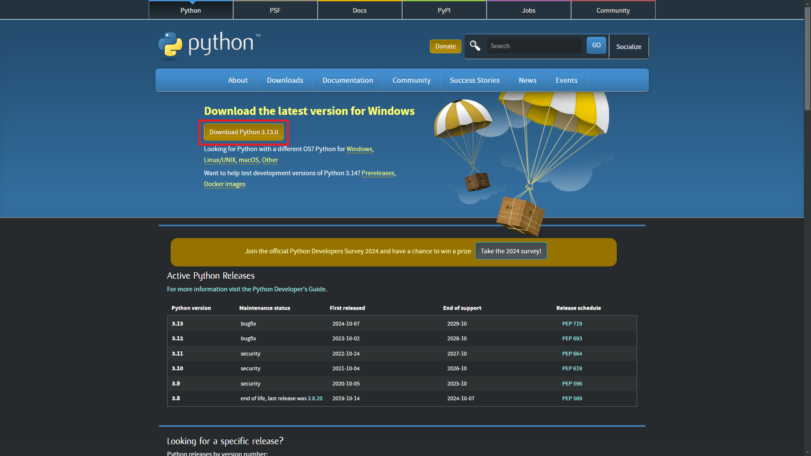
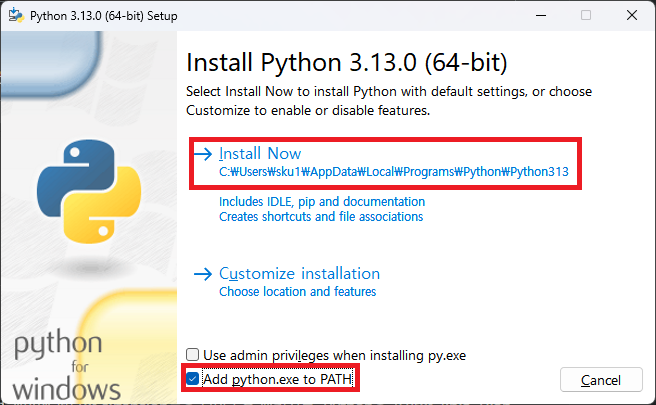

## # 파이썬 설치
파이썬(Pyhton)을 개발하기 위해서는 먼저 파이썬을 설치 해야 합니다. 파이썬을 다운로드 하기 위하는 주소는 아래와 같습니다.

- 다운로드: [https://www.python.org/downloads/](https://www.python.org/downloads/)

2024년 10월 기준으로 3.13.0 버전이 최신 버전입니다. 다운로드 버튼을 눌러 다운로드 합니다.

파이썬 설치 시 "Add python.exe to PATH"를 반드시 체크 하도록 합니다.

혹시나 체크를 하지 않고 설치 되었다면, 직접 환경 변수에 아래 경로를 추가해 줍니다.

 - %userprofile%\AppData\Local\Programs\Python\Python313
 - %userprofile%\AppData\Local\Programs\Python\Python313\Scripts

## # Visual Code 설치

## # Hello Python!
