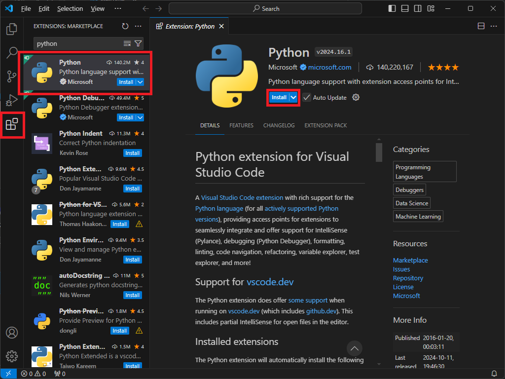
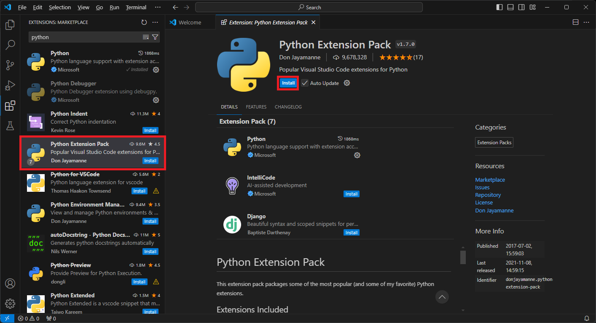
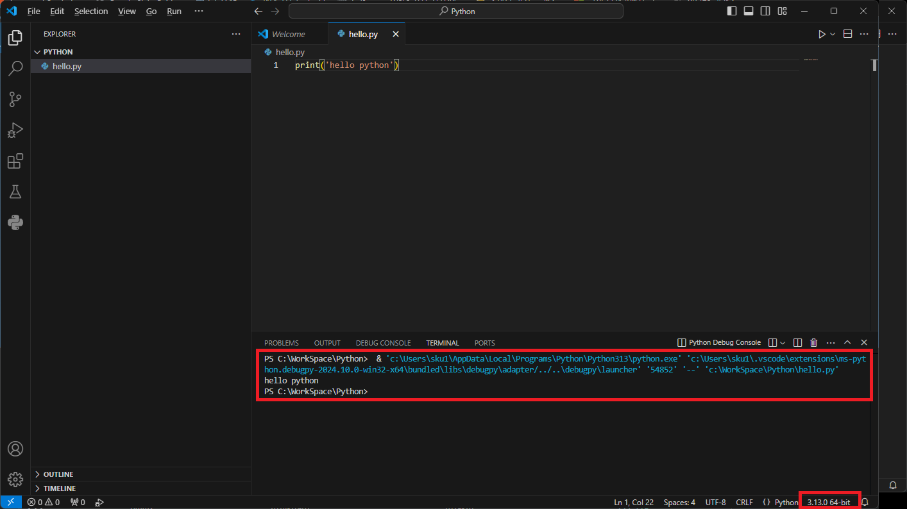

## # 파이썬 설치
파이썬(Pyhton)을 개발하기 위해서는 먼저 파이썬을 설치 해야 합니다. 파이썬을 다운로드 하기 위하는 주소는 아래와 같습니다.

- 다운로드: [https://www.python.org/downloads/](https://www.python.org/downloads/)

2024년 10월 기준으로 3.13.0 버전이 최신 버전입니다. 다운로드 버튼을 눌러 다운로드 합니다.


파이썬 설치 시 "Add python.exe to PATH"를 반드시 체크 하도록 합니다.


혹시나 체크를 하지 않고 설치 되었다면, 직접 환경 변수에 아래 경로를 추가해 줍니다.

 - %userprofile%\AppData\Local\Programs\Python\Python313
 - %userprofile%\AppData\Local\Programs\Python\Python313\Scripts

 환경 변수 추가하는 방법은 아래 링크를 통해 확인하세요.
 - [환경 변수 추가 하는 방법](https://x2info.github.io/pc/%ED%99%98%EA%B2%BD%EB%B3%80%EC%88%98_%ED%8E%B8%EC%A7%91%ED%95%98%EA%B8%B0/)

## # Visual Code 설치
파이썬을 설치 했으니, 이제는 파이썬을 개발할 IDE Tool을 설치할 차례입니다. 저는 Visaul Code로 설치하겠습니다. Visual Stuiod로도 가능하지만, Visual Code에 비해 무거운 단점이 있습니다.
> 통합 개발 환경 IDE(Integrated Development Environment, IDE)는 코딩, 디버그, 컴파일, 배포 등 프로그램 개발에 관련된 모든 작업을 하나의 프로그램 안에서 처리하는 환경을 제공하는 소프트웨어이다.


- 다운로드: [https://code.visualstudio.com/](https://code.visualstudio.com/)

다운로드하고 설치 했으면, 이제 파이썬과 관련된 Extention을 설치할 차례 입니다. 좌측 Extensions 메뉴에서 python을 검색하고 나온 Extension중에 가장 다운로드가 많은 python을 선택하고 install 합니다.



추가적으로 python 개발 시 필요한 여러 Extension이 포함된 python extension pack도 필수는 아니지만 설치해줍니다.


## # Hello Python!
이제 파이썬과 Visual Code를 모두 설치 했으니, Hello python을 찍어볼 차례입니다. 아래 코드를 입력하고 ctrl+f5(디버깅 없이 실행)를 눌러 실행해봅니다.

```python
print('hello python')
```

정상적으로 hello python이 출력되고, 우측 하단에 우리가 설치한 python 버전이 보이는 것을 볼 수 있습니다.
