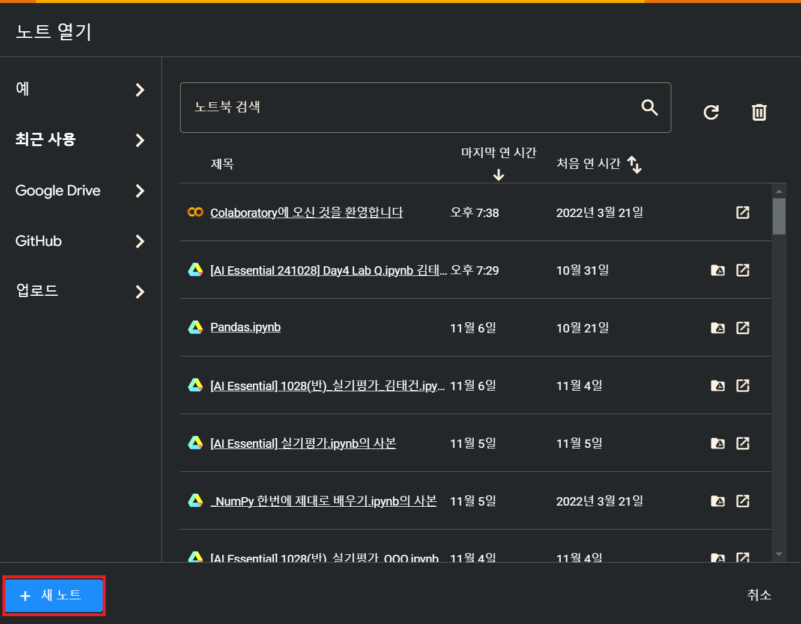
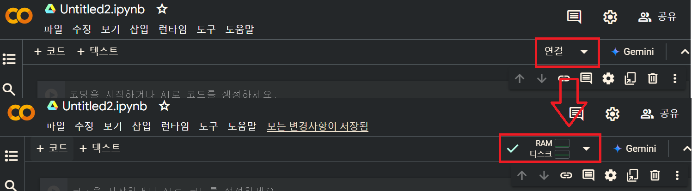
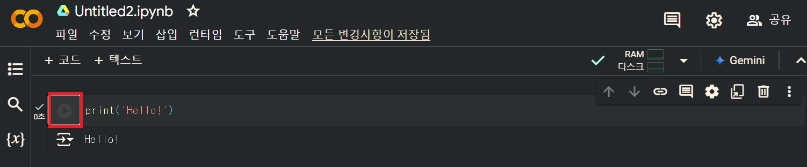
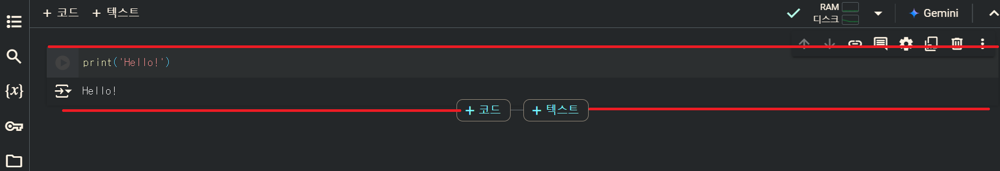

## # 구글 Colab 시작하기
구글 Colab을 사용하기 위해서는 구글 계정만 준비되어 있으면 됩니다. 구글 계정이 있다면, **[Google Colab](https://colab.google/){: target="_blank"}** 으로 이동한 뒤 우측 상단의 "Open Colab버튼"을 클릭합니다.


"+ 새 노트" 버튼을 클릭해서 노트를 추가 합니다.



연결 버튼을 눌러서 클라우드 컴퓨터에 접속합니다. 이제 준비가 다 되었습니다.



아래와 같이 코드를 입력하고 앞에 플레이 모양 아이콘을 클릭하면 정상적으로 실행됩니다.



## # 셀 추가
구글 Colab에서는 셀 단위로 작업이 이뤄집니다. 셀은 크게 코드와 텍스트로 나눠져 있으며, 코드는 말 그대로 파이썬 코드를 입력하고 실행 할 수 있는 셀입니다. 그리고 텍스트는 마크다운를 지원함으로서 코드에 대한 설명과 필요한 텍스트를 입력할 수 있습니다.

추가하는 방법은  상단의 "+ 코드" 혹은 "+ 텍스트"를 눌러서 추가 할 수 있습니다.


또는 셀의 위 아래 테두리에 마우스 커서를 올리면 동일하게 셀을 추가 할 수 있습니다.



단축키로는 아래와 같이 셀을 추가 할 수 있습니다.
- 현재 셀 위치에서 위로 코드 셀 추가: Ctrl + M A
- 현재 셀 위치에서 아래로 코드 셀 추가: Ctrl + M B


## # 유용한 단축키

유용한 단축키에 대해서 알아 보겠습니다. 우선 실행 단축키 입니다. 셀을 실행 후에 셀 위치를 그대로 유지 할 수 있는 Ctrl+Enter가 가장 많이 씁니다.
```
 - 셀 실행 후 셀 위치 그대로 유지: Ctrl + Enter
 - 선택한 셀을 실행하고 다음 셀로 이동: Shift + Enter	
 - 셀 실행 후 아래에 새 셀 추가: Alt + Enter	
 ```


 다음은 셀 추가 하는 단축키 입니다. 가장 많이 사용하는 단축키 중 하나 입니다. A는 Above, B는 Below로 이해하면 외우기 쉽습니다.
 ```
 - 현재 셀 위치에서 위로 코드 셀 추가: Ctrl + M A
 - 현재 셀 위치에서 아래로 코드 셀 추가: Ctrl + M B
```

 다음은 셀 유형을 변경하는 단축키 입니다. 기본 셀은 코드 셀로 추가되기 때문에 Ctrl + M Y만 외우셔도 상관없습니다.
 ```
 - 코드 셀 에서 텍스트 셀로 전환: Ctrl + M M
 - 텍스트 셀에서 코드 셀로 전환: Ctrl + M Y
```

 다음은 셀 삭제 단축키 입니다. 여러 셀을 삭제하고자 할 경우 ESC키를 입력 모드를 편집 모드로 전환합니다. 그리고 쉬프트 + 방향키로 여러셀을 선택한 후 Ctrl + M D를 누르면 됩니다.
 ```
 - 셀 삭제: Ctrl + M D
```

 다음은 셀 편집 되돌리기 입니다. 코드 편집 중에 되돌리기를 할 경우에는 Ctrl + Z로 되돌리기가 가능하며, 셀을 삭제하거나 추가한것을 되돌릴 경우에는 아래의 단축키를 이용합니다.
 ```
 - 셀 편집 되돌리기: Ctrl + M Z
 ```


 마지막으로 전체 단축키 볼 수 있는 단축키는 Ctrl + M H 입니다. 


